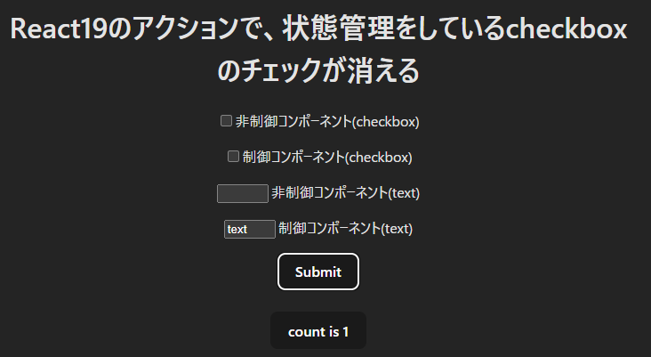
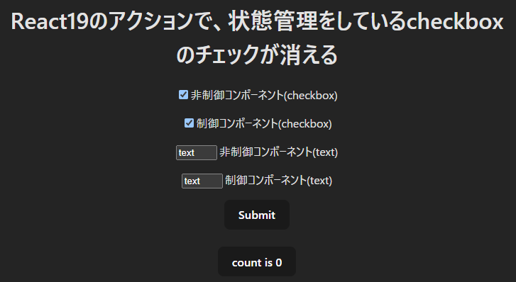
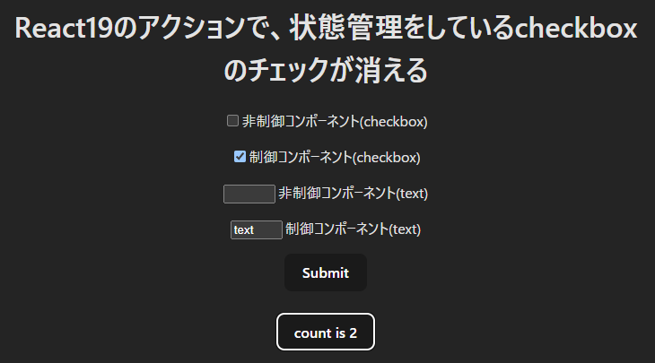

# React19の&lt;form&gt;アクションで、checkbox(制御コンポーネント)のチェックが消されてしまう

## はじめに

React19の新機能([&lt;form&gt;アクション](https://ja.react.dev/blog/2024/12/05/react-19#form-actions))を利用すると、checkboxがクリアされてしまうという(不思議な)現象に遭遇しました

Reactの[&lt;form&gt;アクション説明ページ](https://ja.react.dev/blog/2024/12/05/react-19#form-actions)では「非制御コンポーネント」をクリアすると明記されています（逆に、制御コンポーネントはクリアしない動作が正しい）

> <form> アクションが成功すると、React は非制御コンポーネントの場合にフォームを自動的にリセットします。


2024/12に[issue #31695](https://github.com/facebook/react/issues/31695)として登録されていますが、その後の進捗はないようです

[[React 19] Controlled checkboxes are reset by form submission and form.reset() #31695](https://github.com/facebook/react/issues/31695)


* チェックをつけた状態でActionを実行するとcheckが外れる(textは保持されている)



※ shadcn/ui の&lt;Checkbox&gt;でも同じ動作になるため、issueがあがっています

[Checkbox resets its INTERNAL state in the form and delivers none to FormData after a button with formAction is clicked #3444](https://github.com/radix-ui/primitives/issues/3444)

## 再現プログラム

* テスト環境を作成

```
$ npm create vite@latest react19-action-checkbox -- --template react-ts
$ cd react19-action-checkbox
$ npm install
$ code .
```

* App.tsxを以下のように修正する
  * checkboxとtextboxを2つ用意し、一方は非制御、もう一方は制御コンポーネントとする
  * Submitボタンを押下すると[&lt;form&gt;アクション](https://ja.react.dev/blog/2024/12/05/react-19#form-actions)を実行する
  * &lt;form&gt;を(送信することなく)再描画させるために「count」ボタンを用意する

```tsx:App.tsx
import { useState } from 'react';

type ActionHandler = (formData: FormData) => void | Promise<void>;
const Form = ({ actionHandler }: { actionHandler: ActionHandler }) => {
  const [checked, setChecked] = useState(false);
  const [text, setText] = useState('');

  return (
    <form action={actionHandler}>
      <p>
        <input type="checkbox" id="checkbox1" />
        <label htmlFor="checkbox1">非制御コンポーネント(checkbox)</label>
      </p>
      <p>
        <input
          type="checkbox"
          id="checkbox2"
          checked={checked}
          onChange={(e) => setChecked(e.target.checked)}
        />
        <label htmlFor="checkbox2">制御コンポーネント(checkbox)</label>
      </p>
      <p>
        <input type="text" id="text1" />
        <label htmlFor="text1">非制御コンポーネント(text)</label>
      </p>
      <p>
        <input
          type="text"
          id="text2"
          value={text}
          onChange={(e) => setText(e.target.value)}
        />
        <label htmlFor="text2">制御コンポーネント(text)</label>
      </p>
      <button type="submit">Submit</button>
    </form>
  );
};

function App() {
  const [count, setCount] = useState(0);
  const actionHandler = async (formData: FormData) => {
    console.log('checkbox1', formData.get('checkbox1'));
    await fetch('https://httpstat.us/200', {
      method: 'POST',
      body: JSON.stringify({ count: count + 1 }),
    });
    setCount((prevCount) => prevCount + 1);
  };

  return (
    <>
      <h1>
        React19のアクションで、状態管理をしているcheckboxのチェックが消える
      </h1>
      <div className="card">
        <Form actionHandler={actionHandler} />
        <br />
        <button
          onClick={(e) => {
            e.preventDefault();
            setCount((count) => count + 1);
          }}
        >
          count is {count}
        </button>
      </div>
    </>
  );
}

export default App;

```

## 再現手順

* checkboxにチェックをつけ、textに適当な値を入力する


* 「Submit」をクリックすると、制御コンポーネント(checkbox)もクリアされてしまう


* chckboxの`state`は保持されているので、コンポーネントが再描画される(countボタンをクリック)とチェック状態に戻る(stateとDOMの状態が不一致な状態)




## 対応方法

1. action をやめて通常の onSubmit＋preventDefault で送信

   React18までのやり方を踏襲する

2. action 実行後、&lt;form&gt;の再描画を行う

   アクション実行後、&lt;form&gt;のkeyを変更することで再描画を行う。checkboxのstate自体は保持されているため、チェックされた状態に戻る

```tsx
  const [formVersion, forceUpdate] = useState(0);

  return (
    <form
      key={formVersion}
      action={(formData) => {
        actionHandler(formData);
        forceUpdate((prev) => prev + 1);
      }}
    >
```

1. が無難かと思います。2.もやってみましたが、違和感なく表示されました
